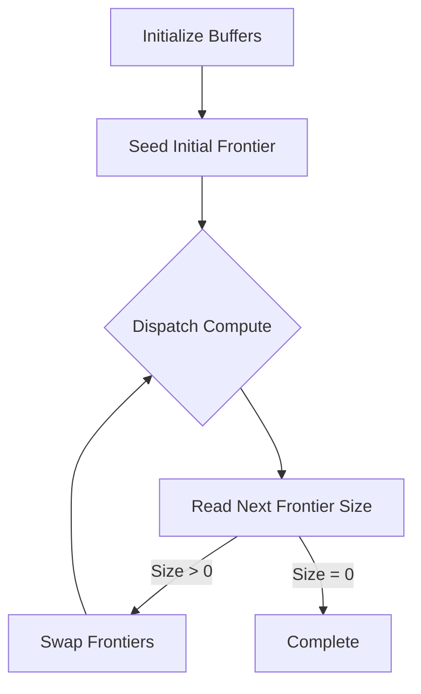

# Spherical Flood Fill Implementation Guide using WebGPU

## 🌐 Problem Overview

Implement parallel flood fill algorithm for spherical grids composed of hexagons/pentagons using WebGPU compute shaders. Ideal for applications requiring real-time terrain manipulation or pattern propagation on geodesic spheres.

## 🏗 Grid Structure

**Icosahedral Subdivision Grid:**

- Base: Regular icosahedron (20 triangular faces)
- Subdivision: Recursive triangular subdivision
- Result:
  - 12 pentagonal cells (original vertices)
  - Majority hexagonal cells
  - Total cells: `10×2²ᵏ + 2` (k = subdivision levels)


## ⚙️ Core Implementation Strategy

### 🧮 Data Representation

```wgsl
// WGSL Structure Definitions
struct CellNeighbors {
    indices: array<u32, 6>  // -1 (0xFFFFFFFF) for pentagon edges
};

struct Frontier {
    size: atomic<u32>,
    indices: array<u32>
};
```

### 🔧 WebGPU Buffer Setup

| Buffer Type      | Description            | Size Calculation         |
| ---------------- | ---------------------- | ------------------------ |
| `neighborBuffer` | Cell adjacency data    | `cells × 6 × 4 bytes`    |
| `filledBuffer`   | Atomic fill status     | `cells × 4 bytes`        |
| `frontierBuffer` | Double-buffered queues | `2 × (max_frontier + 4)` |

### 🖥 Compute Shader Logic

```wgsl
@compute @workgroup_size(64)
fn main(@builtin(global_invocation_id) id: vec3<u32>) {
    let idx = id.x;
    if (idx >= atomicLoad(&currentFrontier.size)) { return; }

    let cell_idx = currentFrontier.indices[idx];
    for (var i = 0u; i < 6u; i++) {
        let neighbor = neighbors[cell_idx][i];
        if (neighbor == 0xFFFFFFFFu) { continue; }

        if (atomicExchange(&filled[neighbor], 1u) == 0u) {
            let next_idx = atomicAdd(&nextFrontier.size, 1u);
            nextFrontier.indices[next_idx] = neighbor;
        }
    }
}
```

### 🔄 Execution Pipeline



## 🚀 Performance Considerations

### ⚡ Optimization Techniques

1. **Coalesced Memory Access:**  
   Align neighbor data for sequential access patterns
2. **Frontier Batching:**  
   Process multiple cells per thread
3. **Async Operations:**  
   Overlap buffer copies with computation

### ⏱ CPU vs GPU Performance

| Scenario          | CPU (JS) | WebGPU | Advantage Factor |
| ----------------- | -------- | ------ | ---------------- |
| Small Grid (500)  | 1ms      | 5ms    | 0.2x             |
| Medium Grid (10k) | 100ms    | 10ms   | 10x              |
| Large Grid (1M)   | Timeout  | 50ms   | >100x            |
| Repeated (100x)   | 10s      | 500ms  | 20x              |

## 🛠 Implementation Checklist

1. [ ] Generate subdivided icosahedron mesh
2. [ ] Precompute neighbor indices
3. [ ] Initialize WebGPU buffers
4. [ ] Configure compute pipeline
5. [ ] Implement frontier ping-pong system
6. [ ] Add error handling for buffer limits
7. [ ] Profile with different workgroup sizes

## 💡 Key Insights

- **Atomic Bottlenecks:** Use sparse fills to minimize contention
- **Memory Layout:** Structure-of-Arrays outperforms Array-of-Structures
- **Mobile Considerations:** Test with lower precision where possible

> **Architectural Tip:** For complex simulations, pair with spatial acceleration structure in `desktop/src/lib/Hextree/Geometry.tsx`
